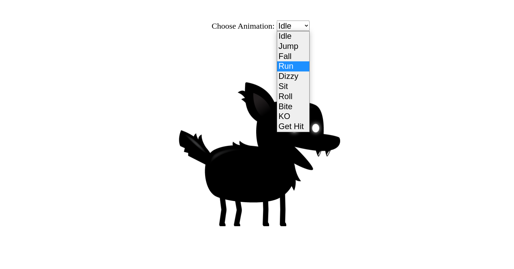

   

  <h2>Sprite animation with html canvas, css and javascript.</h2>

  <a href="#about"> About </a> &nbsp;&nbsp;&nbsp;| &nbsp;&nbsp;&nbsp;
  <a href="#presentation">Presentation</a> &nbsp;&nbsp;&nbsp;|&nbsp;&nbsp;&nbsp;
  <a href="#getting-started">Getting started</a> &nbsp;&nbsp;&nbsp;|&nbsp;&nbsp;&nbsp;
  <a href="#license">License</a>

## About the project

Sprite animation with html, css and javascript. In this project the <b>canvas element</b> is used to get complete control over an sprite sheet. The user can choose from ten animations and see the <b>shadow dog</b> adapt respectively.

<h3> See the application demo <a target="_blank" href="https://roberttmello-sprite-animation.vercel.app/">HERE</a>.</h3>

## Presentation

Some screenshots of the application interface.

   

##

   

## Getting started

This is a simple project with html, css and vanilla javascript, the only detail to run this project on your machine is that to run all the canvas functions you need to execute the code on a local server. My advice is to use the server built into the VS Code editor itself or use an extension like the "Live Server".

## License

 This project is licensed under the MIT License - see the [LICENSE](https://opensource.org/licenses/MIT) page for details.

